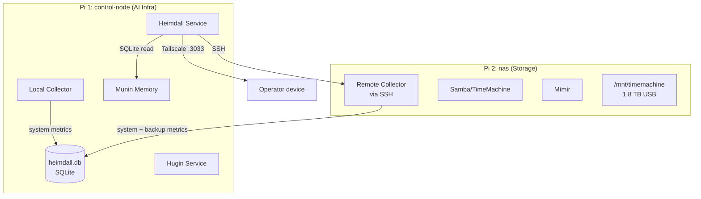
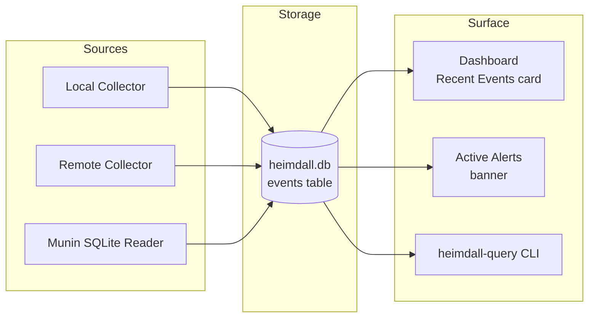
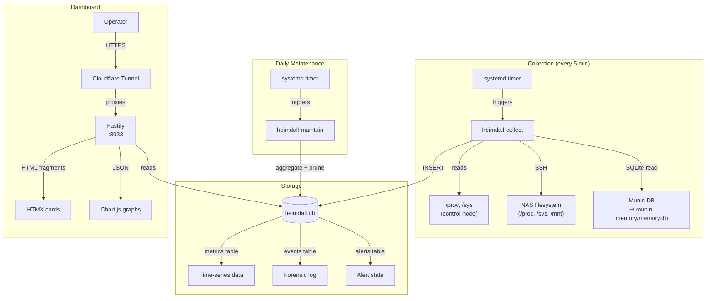
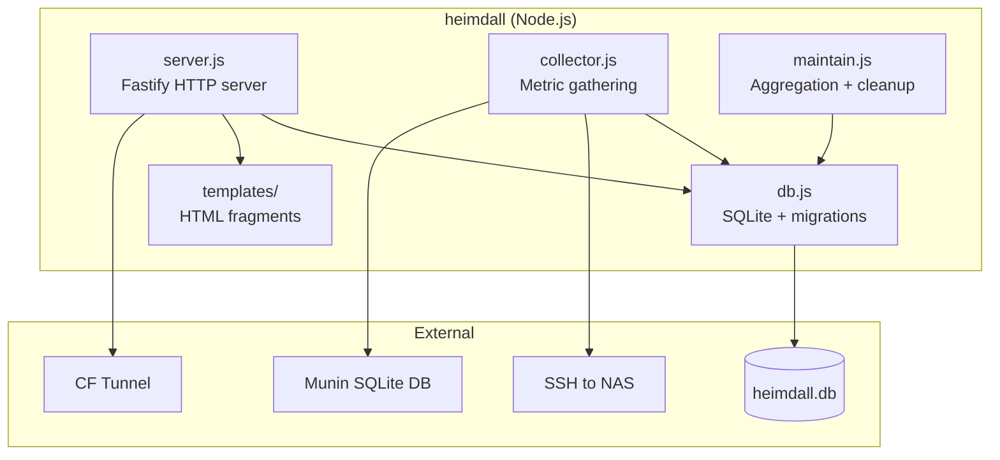

# Heimdall — Architecture Plan

> *Heimdall, the watchman of the gods, sees all and hears all from his post at Bifröst.*

**Version:** 1.2 — 2026-03-15 (post-debate revision — addresses all 11 action items)
**Status:** Historical v1 design record. The implementation has since moved to v2; see `architecture-v2.md` and the README for current behavior.

---

## Table of Contents

1. [System Overview](#1-system-overview)
2. [Data Collection](#2-data-collection)
3. [Data Storage](#3-data-storage)
4. [Dashboard](#4-dashboard)
5. [Forensic Logging](#5-forensic-logging)
6. [Security](#6-security)
7. [Deployment](#7-deployment)
8. [Appendix: Diagrams](#8-appendix-diagrams)

---

## 1. System Overview

Heimdall began as a lightweight monitoring dashboard for a two-node Raspberry Pi infrastructure. It provides at-a-glance health visibility, backup freshness tracking, disk usage trending, and forensic logging for autonomous operations (Hugin task execution, Munin state changes).

### Design Principles

1. **Agent-maintainability** — AI coding agents are primary maintainers. Simple code, few files, minimal abstraction, standard libraries.
2. **Low resource usage** — Runs on a Pi 5 (8 GB, ~6.9 GB available) alongside Hugin, Munin, and Cloudflare Tunnel. Resource usage validated during implementation — the Pi 5 has ample headroom.
3. **Easy to extend** — Adding a new metric = adding a collector function and a dashboard card. No framework ceremony.
4. **Visual clarity** — Key information at a glance on mobile, with drill-down for details.
5. **No external dependencies** — No cloud services, no Docker, no databases beyond SQLite. Everything runs locally.

### What Heimdall Monitors

| Category | Metrics | Sources |
|----------|---------|---------|
| System Health | CPU temp, memory usage, load average | Both Pis (local + SSH) |
| Temperature History | Temp trend over hours/days, alert thresholds | Collected samples |
| Uptime & Connectivity | Pi reachability, internet connectivity, uptime | Ping + systemd |
| Backup Freshness | TM last backup, Munin backup age, sizes | NAS filesystem |
| Disk Usage | SD card + NAS drive capacity/used/free/trend | `df` on both Pis |
| Hugin Tasks | Active/pending/completed tasks, execution history | Munin SQLite (direct read) |
| Deploy Drift | Service version vs git remote, commits behind | `/health` endpoints + `git ls-remote` |

### Topology



---

## 2. Data Collection

### Collection Strategy: Pull Model with Systemd Timer

Heimdall uses a **pull model**: a single collector process runs on a schedule, gathers all metrics, and writes them to SQLite. This is simpler and more reliable than agents or push-based models.

**Why pull over push:**
- One process to debug, one log stream to check
- No agent installation on the NAS Pi
- No network listener to secure (SSH is already there)
- Failed collections are obvious in the timer log

### Collector: `heimdall-collect`

A single Node.js script that runs every 5 minutes via systemd timer:

```
heimdall-collect
├── collectLocal()         — CPU temp, memory, disk, load, uptime
├── collectRemote()        — SSH to NAS, same metrics + backup state
├── collectBackups()       — TM freshness, Munin backup count/age
├── collectHuginTasks()    — Query Munin MCP for task state
├── collectServiceDrift()  — Compare deployed vs latest git commits
└── writeMetrics()         — Insert all into SQLite
```

#### Local Metrics Collection

```javascript
// CPU temperature
const temp = fs.readFileSync('/sys/class/thermal/thermal_zone0/temp') / 1000;

// Memory
const meminfo = fs.readFileSync('/proc/meminfo', 'utf8');

// Disk usage
const df = execSync('df --output=source,size,used,avail,pcent /dev/mmcblk0p2 /dev/sda1 2>/dev/null');

// Load average
const loadavg = fs.readFileSync('/proc/loadavg', 'utf8');

// Uptime
const uptime = parseFloat(fs.readFileSync('/proc/uptime', 'utf8'));
```

#### Remote Metrics Collection (NAS via SSH)

Single SSH command per collection cycle (fresh connection each time — the ~200ms handshake cost is negligible on a 5-minute interval):

```bash
ssh -i ~/.ssh/heimdall_ed25519 -o ConnectTimeout=5 heimdall@192.0.2.20 '
  cat /sys/class/thermal/thermal_zone0/temp
  echo "---"
  cat /proc/meminfo
  echo "---"
  df --output=source,size,used,avail,pcent /dev/mmcblk0p2 /dev/sda1
  echo "---"
  cat /proc/loadavg
  echo "---"
  cat /proc/uptime
  echo "---"
  stat -c "%Y" "/mnt/timemachine/Workstation.sparsebundle/com.apple.TimeMachine.SnapshotHistory.plist"
  echo "---"
  du -sb "/mnt/timemachine/Workstation.sparsebundle/"
  echo "---"
  ls /home/heimdall/backups/munin-memory/ | tail -1
  echo "---"
  ls /home/heimdall/backups/munin-memory/ | wc -l
  echo "---"
  tail -1 /home/heimdall/mimir-server/backup.log
'
```

**Note:** The NAS uses a forced command (`heimdall-collect.sh`) on the SSH key, so the actual command sent is ignored. The script on the NAS must match `parseSSHOutput` section numbering (0–17). No SSH ControlMaster — fresh connections avoid stale socket issues and are simple to debug. The handshake overhead (~200ms) is irrelevant at 5-minute intervals.

#### Backup Freshness Detection

| Backup | How to detect freshness |
|--------|------------------------|
| Time Machine | `stat` the `SnapshotHistory.plist` mtime in the sparsebundle |
| Munin Memory | Latest filename in `/home/heimdall/backups/munin-memory/` (filename contains timestamp) |
| Mímir Backup | Last line of `/home/heimdall/mimir-server/backup.log` on NAS |
| Mímir Sync | Newest file mtime in `/home/heimdall/artifacts/mgc/` on NAS |

#### NAS Disk Metrics (Refined)

Raw `df` for the NAS drive is noisy because Time Machine snapshot churn causes fluctuations. Heimdall tracks:
- **Free space** (`df` output) — the canonical "how much room is left"
- **TM sparsebundle size** (`du -sb` on the bundle) — actual TM consumption
- **Projected days until 1.5T limit** — linear extrapolation from TM size trend
- **SD card usage** — `df` percentage (stable, useful as a canary)

#### Hugin Task Collection

Read Munin's SQLite database directly (both run on the same Pi, same user):

```javascript
// Direct read-only access to Munin's database — no MCP protocol needed
const munin = new Database(
  path.join(os.homedir(), '.munin-memory/memory.db'),
  { readonly: true }
);

// Query task state entries
const tasks = munin.prepare(`
  SELECT namespace, key, content, tags, updated_at
  FROM state_entries
  WHERE namespace LIKE 'tasks/%'
  ORDER BY updated_at DESC
  LIMIT 50
`).all();
```

**Why direct SQLite, not MCP:** MCP requires a handshake protocol (initialize → tool calls) and uses stdio/SSE transport. Direct SQLite read is simpler, faster, and has zero protocol complexity. WAL mode supports concurrent readers safely.

#### Deploy Drift Detection

Compares deployed service versions against their git remote `main` branch to surface stale deployments.

**Prerequisite:** Each service's `/health` endpoint returns a `version` field with its deployed git commit hash:
```json
{"status": "ok", "version": "e626959", "service": "munin-memory"}
```

**Collection logic:**
```javascript
async function collectServiceDrift() {
  const services = loadServiceRegistry(); // from config file
  for (const svc of services) {
    // Step 1: Get deployed version from /health endpoint
    let deployed = null;
    try {
      const health = await fetch(svc.health_url).then(r => r.json());
      deployed = health.version;
    } catch { /* service unreachable — recorded as null */ }

    // Step 2: Get latest commit from git remote
    const latest = execSync(
      `git ls-remote https://github.com/${svc.repo}.git HEAD | cut -f1`
    ).toString().trim().slice(0, 7);

    // Step 3: Calculate commits behind (if both available)
    let commitsBehind = null;
    if (deployed && latest && deployed !== latest) {
      // Use local clone if available, otherwise just flag as "behind"
      commitsBehind = -1; // -1 = behind but count unknown without local clone
    } else if (deployed === latest) {
      commitsBehind = 0;
    }

    writeServiceVersion(svc.name, svc.host, deployed, latest, commitsBehind);
  }
}
```

**Service registry** (`heimdall.config.json`):
```json
{
  "services": [
    {
      "name": "munin-memory",
      "host": "control-node",
      "health_url": "http://localhost:3030/health",
      "repo": "Magnus-Gille/munin-memory"
    },
    {
      "name": "mimir",
      "host": "nas",
      "health_url": "http://192.0.2.20:3040/health",
      "repo": "Magnus-Gille/mimir"
    }
  ]
}
```

**Dashboard card:**
- **Green:** All services up to date (deployed == latest)
- **Amber:** 1+ services have drift (deployed != latest)
- **Red:** Service unreachable or `/health` doesn't return version

### Collection Schedule

| Metric Category | Interval | Rationale |
|----------------|----------|-----------|
| System health (temp, mem, load) | 5 minutes | Balances granularity with storage |
| Disk usage | 30 minutes | Disk changes slowly |
| Backup freshness | 15 minutes | TM backs up hourly, want to catch staleness within the hour |
| Hugin tasks | 5 minutes | Near-real-time task visibility |
| Connectivity check | 5 minutes | Detect outages quickly |
| Deploy drift | 5 minutes | `git ls-remote` is lightweight; quick detection of stale deploys |

**Implementation:** Single timer at 5-minute intervals. Disk and backup checks still run every cycle (they're cheap) but are stored at their respective granularities via `INSERT OR IGNORE` with time-bucket keys.

### Failure Handling

#### NAS Liveness State Machine

The collector must distinguish between different failure modes to avoid misreporting a healthy NAS as unreachable. Before its first successful SSH collection it is `unknown`; after that it has four operational states:

```
┌──────────────────┐    ping fails    ┌──────────────────┐
│   NAS_HEALTHY    │ ───────────────► │ NAS_UNREACHABLE  │
│                  │ ◄─────────────── │                  │
│ ping ✓, SSH ✓,  │    ping ok       │ ping ✗           │
│ all probes ✓    │                  │ Host is down or  │
└──────┬───────────┘                  │ network broken   │
       │                              └──────────────────┘
       │ SSH fails
       ▼
┌──────────────────┐                  ┌──────────────────┐
│  NAS_SSH_BROKEN  │    probes fail   │  NAS_DEGRADED    │
│                  │ ◄─── (partial)── │                  │
│ ping ✓, SSH ✗   │                  │ ping ✓, SSH ✓,   │
│ Host reachable   │                  │ some probes fail │
│ but collection   │                  │ (e.g. TM stat    │
│ broken           │                  │ fails, df ok)    │
└──────────────────┘                  └──────────────────┘
```

A fifth implicit state is **STALE_DATA**: any state where the last successful collection is >15 minutes old. This overlays the other states.

**Authoritative liveness signal:** ICMP ping to the NAS Tailscale IP (`192.0.2.20`). Tailscale IP is used because:
- It works regardless of LAN topology changes
- It's routable from control-node whether on LAN or remote
- Tailscale maintains the WireGuard tunnel; if the host is up, the Tailscale IP responds to ping

**Collection sequence per cycle:**

```javascript
async function collectRemote() {
  // Step 1: Liveness check — ICMP ping via Tailscale IP
  const pingOk = await ping('192.0.2.20', { timeout: 3 });

  if (!pingOk) {
    // State: NAS_UNREACHABLE — host is down or network broken
    recordNASState('unreachable');
    recordNullMetrics('nas');
    logEvent('system', 'critical', 'NAS host unreachable (ping failed)');
    return;
  }

  // Step 2: SSH collection
  try {
    const sshResult = await execSSH(NAS_COLLECTION_COMMAND, { timeout: 5000 });
    const parsed = parseSSHOutput(sshResult);

    // Step 3: Check individual probe results
    const failures = parsed.filter(p => p.value === null);
    if (failures.length === 0) {
      // State: NAS_HEALTHY — all probes succeeded
      recordNASState('healthy');
    } else if (failures.length === parsed.length || parsed.length === 0) {
      // State: NAS_DEGRADED (total) — SSH worked but all probes failed
      // This catches: malformed output, empty response, all-null values
      recordNASState('degraded', { failedProbes: failures.map(f => f.name), total: true });
      recordNullMetrics('nas');
      logEvent('system', 'error',
        'NAS SSH succeeded but all probes failed — possible parse error or remote script issue');
    } else {
      // State: NAS_DEGRADED (partial) — some probes failing
      recordNASState('degraded', { failedProbes: failures.map(f => f.name) });
      logEvent('system', 'warning',
        `NAS degraded: ${failures.map(f => f.name).join(', ')} failed`);
    }
    writeMetrics(parsed); // writes non-null values; null probes recorded as NULL in DB
  } catch (sshErr) {
    // State: NAS_SSH_BROKEN — host reachable but SSH failed
    recordNASState('ssh_broken', { error: sshErr.message });
    recordNullMetrics('nas');
    logEvent('system', 'error',
      'NAS reachable but SSH collection failed', { error: sshErr.message });
  }
}
```

**Dashboard display per state:**

| NAS State | Status Indicator | Detail |
|-----------|-----------------|--------|
| `unknown` | 🔴 Unknown | "Storage probe has not yet completed successfully" |
| `NAS_HEALTHY` | 🟢 Online | Normal metrics display |
| `NAS_UNREACHABLE` | 🔴 Unreachable | "Host down — ping failed. Last seen: {timestamp}" |
| `NAS_SSH_BROKEN` | 🟠 SSH Failed | "Host reachable but SSH collection broken. Last data: {timestamp}" |
| `NAS_DEGRADED` | 🟡 Degraded | "Partial collection — {N} probes failing: {list}" |
| (any) + stale >15m | ⚠️ Stale | Amber overlay: "Data is {age} old" |
| (any) + stale >1h | 🔴 Stale | Red overlay: "No fresh data for {age}" |

**NAS address for SSH collection:** Tailscale IP (`192.0.2.20`) for the same reasons as liveness checks — works across network topologies. The ~1ms latency difference vs LAN IP is irrelevant at 5-minute intervals.

#### Other Failure Modes

- **Munin unreachable:** Same pattern as NAS — `null` metrics, logged failure. Since Munin is on the same host, this indicates a SQLite lock or file permission issue, not a network problem.
- **Collector crash:** Systemd `Restart=on-failure` with 30s backoff. The timer fires again in 5 minutes regardless.
- **Stale data detection:** Dashboard shows data age for each metric. If >15 minutes old, amber warning. If >1 hour, red alert.
- **Overlapping collections:** The systemd oneshot service prevents overlap — if a previous collection is still running when the timer fires, systemd skips the new invocation. No `flock` or manual locking needed.

### Uptime Calculation

Host uptime percentage is calculated from collector success rate:
- Each successful collection = host was reachable
- `uptime_pct = successful_collections / expected_collections * 100` over a given period
- Expected collections = `period_minutes / 5` (one per 5-minute interval)
- Displayed as: "99.8% (7d)" on the dashboard

### Timezone Display

All timestamps stored in UTC (ISO 8601). Dashboard renders in CET/CEST (Europe/Stockholm) using the `Intl.DateTimeFormat` API for correct DST handling.

---

## 3. Data Storage

### SQLite — Single Database

All time-series metrics and forensic logs live in a single SQLite database: `~/.heimdall/heimdall.db`.

**Why SQLite:**
- Zero configuration, zero maintenance
- Handles the write load easily (one batch insert per 5 minutes)
- WAL mode for concurrent reads during dashboard serving
- Battle-tested backup strategy (same as Munin — `sqlite3 .backup`)
- Agent-friendly — Claude can query and debug with `sqlite3` CLI

### Schema

```sql
-- Time-series metrics
CREATE TABLE metrics (
    id INTEGER PRIMARY KEY AUTOINCREMENT,
    timestamp TEXT NOT NULL,          -- ISO 8601 UTC
    host TEXT NOT NULL,               -- 'control-node' or 'nas'
    metric TEXT NOT NULL,             -- e.g. 'cpu_temp', 'mem_used_pct', 'disk_used_pct'
    value REAL,                       -- numeric value (NULL = collection failed)
    unit TEXT,                        -- 'celsius', 'percent', 'bytes', 'seconds'
    metadata TEXT                     -- JSON for extra context (e.g. mount point for disk)
);

CREATE UNIQUE INDEX idx_metrics_unique ON metrics(host, metric, timestamp);
CREATE INDEX idx_metrics_time ON metrics(timestamp);

-- Aggregated rollups (hourly and daily min/max/avg)
CREATE TABLE metrics_rollup (
    id INTEGER PRIMARY KEY AUTOINCREMENT,
    period TEXT NOT NULL,             -- 'hourly' or 'daily'
    bucket TEXT NOT NULL,             -- ISO 8601 hour or date (e.g. '2026-03-15T14:00:00Z' or '2026-03-15')
    host TEXT NOT NULL,
    metric TEXT NOT NULL,
    min_value REAL,
    max_value REAL,
    avg_value REAL,
    sample_count INTEGER NOT NULL,
    unit TEXT,
    metadata TEXT
);

CREATE UNIQUE INDEX idx_rollup_unique ON metrics_rollup(period, bucket, host, metric);

-- Forensic event log
CREATE TABLE events (
    id INTEGER PRIMARY KEY AUTOINCREMENT,
    timestamp TEXT NOT NULL,          -- ISO 8601 UTC
    host TEXT NOT NULL,
    category TEXT NOT NULL,           -- 'task', 'backup', 'system', 'security', 'anomaly'
    severity TEXT NOT NULL DEFAULT 'info',  -- 'info', 'warning', 'error', 'critical'
    title TEXT NOT NULL,
    detail TEXT,                      -- JSON or plain text
    source TEXT                       -- 'collector', 'hugin', 'munin', 'system'
);

CREATE INDEX idx_events_lookup ON events(category, timestamp);
CREATE INDEX idx_events_severity ON events(severity, timestamp);

-- Alert state (current unresolved alerts)
CREATE TABLE alerts (
    id INTEGER PRIMARY KEY AUTOINCREMENT,
    created_at TEXT NOT NULL,
    resolved_at TEXT,
    host TEXT NOT NULL,
    category TEXT NOT NULL,
    severity TEXT NOT NULL,
    title TEXT NOT NULL,
    detail TEXT,
    acknowledged INTEGER DEFAULT 0
);

CREATE INDEX idx_alerts_active ON alerts(resolved_at) WHERE resolved_at IS NULL;

-- Deploy drift tracking
CREATE TABLE service_versions (
    id INTEGER PRIMARY KEY AUTOINCREMENT,
    checked_at TEXT NOT NULL,         -- ISO 8601 UTC
    service TEXT NOT NULL,            -- e.g. 'munin-memory'
    host TEXT NOT NULL,               -- e.g. 'control-node'
    deployed_commit TEXT,             -- from /health endpoint (NULL = unreachable)
    latest_commit TEXT,               -- from git ls-remote
    commits_behind INTEGER            -- 0 = up to date, -1 = behind (count unknown), NULL = unknown
);

CREATE INDEX idx_service_versions_lookup ON service_versions(service, checked_at);
```

### Retention Policy

| Data Type | Retention | Downsampling |
|-----------|-----------|--------------|
| Raw metrics (5-min) | 7 days | — |
| Hourly min/max/avg | 90 days | Auto-aggregated by daily maintenance job |
| Daily min/max/avg | 1 year | Auto-aggregated by daily maintenance job |
| Events (info) | 1 year | — |
| Events (warning+) | 1 year | — |
| Alerts | Indefinite | — |

**Maintenance job:** A daily systemd timer runs `heimdall-maintain` which:
1. Aggregates raw metrics older than 7 days into hourly buckets (stores min, max, and avg for each metric)
2. Aggregates hourly metrics older than 90 days into daily buckets (stores min, max, and avg)
3. Deletes raw data older than 7 days
4. Deletes info events older than 1 year
5. Runs `VACUUM` to reclaim space

### Schema Migrations

Simple version-based migrations embedded in `db.js`:

```javascript
const MIGRATIONS = [
  { version: 1, sql: `CREATE TABLE metrics (...); CREATE TABLE events (...); CREATE TABLE alerts (...);` },
  // Future migrations added here
];

function migrate(db) {
  const current = db.pragma('user_version', { simple: true });
  for (const m of MIGRATIONS) {
    if (m.version > current) {
      db.exec(m.sql);
      db.pragma(`user_version = ${m.version}`);
    }
  }
}
```

Uses SQLite's built-in `user_version` pragma — no migration table needed.

### Estimated Storage

- Raw metrics: ~200 rows per collection × 288 collections/day × 7 days = ~400K rows ≈ 50 MB
- Hourly aggregates: ~200 metrics × 24 hours × 90 days = ~430K rows ≈ 30 MB
- Events: Varies, but estimated 50-200/day × 365 days = ~70K rows ≈ 10 MB
- **Total estimated:** <100 MB — negligible on a 58 GB SD card

---

## 4. Dashboard

### Tech Stack Decision

#### Options Evaluated

| Option | Pros | Cons | Verdict |
|--------|------|------|---------|
| **Static HTML + Chart.js, rebuilt by cron** | Simplest possible, no server needed, CDN-cacheable | No live updates, no interactivity, no drill-down — requires full rebuild for each view | Too static for monitoring |
| **Fastify + server-rendered HTML + vanilla JS** | Simple server, familiar pattern, no HTMX dependency | Requires imperative DOM manipulation for live card updates; more JS to write and maintain | Viable alternative |
| **Fastify + HTMX + Chart.js** | Declarative live updates (`hx-get`/`hx-swap`), server owns the truth, no client state management, minimal JS | Adds HTMX dependency (~14 KB), fragment endpoints for each card | **Selected** |
| **SPA + API backend** | Rich interactivity, modern feel | Over-engineered for two-host dashboard, two build systems, client-side state | Too complex |
| **Single-binary Go/Rust server** | Fast, low memory, single binary | Different language from Hugin/Munin ecosystem; harder for Claude to maintain consistently | Wrong ecosystem |

**Why HTMX over vanilla JS:** The deciding factor is **agent-maintainability**. Claude is the primary developer. HTMX's declarative `hx-get="/api/card/system-health" hx-trigger="every 60s" hx-swap="innerHTML"` is more reliably generated, reviewed, and modified by an LLM than equivalent imperative `fetch()` + DOM manipulation code. The vanilla JS alternative is technically simpler but produces more code that is harder to maintain by an AI agent. This is an honest trade-off, not a simplicity claim.

#### Selected: Fastify + HTMX + Chart.js

**Rationale:**

1. **Fastify** — Lightweight Node.js server (~30 MB RSS). Already in the ecosystem (Munin uses Node.js). Fast startup, low overhead.

2. **HTMX** — Server-driven interactivity without writing a SPA. Dashboard cards can auto-refresh independently via `hx-trigger="every 60s"`. No build step, no bundler, no framework. One `<script>` tag. This is the key insight: HTMX gives us live-updating cards with server-rendered HTML fragments, avoiding the complexity of a full SPA while feeling responsive.

3. **Chart.js** — Lightweight charting (~60 KB gzipped). Renders temperature trends, disk usage graphs, and uptime charts. No build step — load from CDN or vendored file.

4. **Inline CSS** — No CSS framework. A single `<style>` block with CSS Grid for the card layout. Mobile-first, responsive. Total: ~200 lines of CSS.

**Why this beats the alternatives:**
- **vs. Static HTML:** HTMX gives live updates and drill-down without a full rebuild cycle
- **vs. Full SPA:** No build system, no state management, no client-side routing. The server owns the truth.
- **vs. Go/Rust:** Node.js is already installed, Claude is fluent in it, and Fastify is lightweight enough

**Honest rationale for Node.js:** This is a pragmatic choice optimized for ecosystem consistency (Hugin and Munin are both Node.js) and AI agent maintainability (Claude writes reliable Node.js). Python would also work (stdlib http.server + sqlite3), but Node.js has advantages: `better-sqlite3` is faster than Python's sqlite3, Fastify handles concurrent HTMX card refreshes natively, and one runtime to maintain across all Pi services. The 30 MB RSS overhead is negligible on ~6.9 GB available RAM.

#### Templating

HTML fragments use **tagged template literals** (native JS, no dependency) with **mandatory HTML escaping** for all dynamic content:

```javascript
// HTML escaping utility — used for ALL dynamic content in templates
function esc(str) {
  if (str == null) return '';
  return String(str)
    .replace(/&/g, '&amp;')
    .replace(/</g, '&lt;')
    .replace(/>/g, '&gt;')
    .replace(/"/g, '&quot;')
    .replace(/'/g, '&#39;');
}

function systemHealthCard(host, metrics) {
  return `
    <h3>${esc(host.name)}</h3>
    <div class="status ${host.online ? 'online' : 'offline'}">
      ${host.online ? '●' : '○'} ${host.online ? `Online (${esc(host.uptime)})` : 'Offline'}
    </div>
    <div class="metric">${esc(metrics.temp)}°C</div>
    <div class="metric">RAM: ${esc(metrics.memPct)}% <progress value="${esc(metrics.memPct)}" max="100"></progress></div>
  `;
}
```

**HTML escaping policy:** All dynamic values inserted into templates MUST be passed through `esc()`. This is a first-class requirement, not an implementation detail. Tagged template literals do not auto-escape, so this must be enforced by convention and code review. The `esc()` function handles the OWASP-recommended HTML entity replacements. This prevents stored XSS from task output, event details, or any other data that may contain HTML-significant characters.

No templating library needed. Each card is a function that returns an HTML string.

#### Chart Data Downsampling

The `/api/metrics/:host/:metric` endpoint applies server-side downsampling using the LTTB (Largest Triangle Three Buckets) algorithm, capped at 200 points per response. This keeps Chart.js responsive on mobile even for 30-day time ranges.

### Dashboard Layout

```
┌──────────────────────────────────────────────────────┐
│  Heimdall — Infrastructure Dashboard                  │
│  Last updated: 2 seconds ago                          │
├──────────────────────┬───────────────────────────────┤
│  control-node          │  nas                           │
│  ● Online (10d 3h)   │  ● Online (10d 3h)            │
│  42.2°C  ▂▃▂▂▃▂     │  40.0°C  ▂▂▁▁▂▁              │
│  RAM: 12% ████░░░░   │  RAM: 14% ████░░░░            │
│  Load: 0.08          │  Load: 0.00                    │
│  SD: 11% ██░░░░░░░   │  SD: 11% ██░░░░░░░            │
│                       │  NAS: 29% ██████░░░░░░░░░░    │
├──────────────────────┴───────────────────────────────┤
│  Backups                                              │
│  ┌──────────┬──────────┬──────────┐                   │
│  │ TM       │ Munin DB │ Mímir    │                   │
│  │ ● Fresh  │ ● Fresh  │ ● Fresh  │                   │
│  │ 56m ago  │ 52m ago  │ 1h ago   │                   │
│  │ 495 GB   │ 2.5 MB   │ —        │                   │
│  └──────────┴──────────┴──────────┘                   │
├──────────────────────────────────────────────────────┤
│  Temperature History (24h)            [24h][7d][30d]  │
│  ┌──────────────────────────────────────────────┐     │
│  │  44°C ╌╌╌╌╌╌╌╌╌╌╌╌╌╌╌╌╌╌╌╌╌╌╌╌╌╌ threshold │     │
│  │  42°C ──╲─────╱──────────╱─── control-node     │     │
│  │  40°C ────╲──╱──────────╱──── nas             │     │
│  │  38°C ─────╲╱──────────╱─────                 │     │
│  │       00:00  06:00  12:00  18:00  00:00       │     │
│  └──────────────────────────────────────────────┘     │
├──────────────────────────────────────────────────────┤
│  Hugin Tasks                                          │
│  ● Running: jarvis-arch-guide (2h 14m)                │
│  ✓ Completed: 5 today, 12 this week                   │
│  Recent: verify ✓, install-codex ✓, update-claude ✓   │
├──────────────────────────────────────────────────────┤
│  Deploy Status                                        │
│  munin-memory  control-node  ✓ e626959 (up to date)    │
│  mimir         nas         ⚠ a1b2c3d → f4e5d6c       │
├──────────────────────────────────────────────────────┤
│  Recent Events                                        │
│  11:00  ● Munin backup completed (2.5 MB → NAS)      │
│  10:56  ● Time Machine backup completed               │
│  10:04  ● Collector: all metrics nominal               │
│  09:15  ● Hugin: push-hugin task completed             │
└──────────────────────────────────────────────────────┘
```

### HTMX Pattern

Each dashboard card is an independently-refreshing HTML fragment:

```html
<!-- Main page loads cards as includes -->
<div class="card" hx-get="/api/card/system-health?host=control-node"
     hx-trigger="load, every 60s" hx-swap="innerHTML">
  <div class="loading">Loading...</div>
</div>

<!-- Server returns a pure HTML fragment -->
<h3>control-node</h3>
<div class="status online">● Online (10d 3h)</div>
<div class="metric">42.2°C <span class="sparkline">▂▃▂▂▃▂</span></div>
<div class="metric">RAM: 12% <progress value="12" max="100"></progress></div>
```

### API Endpoints

| Endpoint | Method | Returns |
|----------|--------|---------|
| `/` | GET | Full dashboard page (HTML) |
| `/api/card/:card` | GET | HTML fragment for a specific card |
| `/api/metrics/:host/:metric` | GET | JSON time-series for charts |
| `/api/events` | GET | Recent events (HTML or JSON) |
| `/api/events/search` | GET | Event search with filters |
| `/api/alerts` | GET | Active alerts |
| `/api/health` | GET | Health check endpoint (includes `version` for drift detection) |
| `/api/card/deploy-status` | GET | HTML fragment: service version drift summary |

### Mobile Optimization

- CSS Grid with `auto-fit` columns — cards stack vertically on narrow screens
- Large touch targets for drill-down links
- System status colors visible at arm's length: green/amber/red
- No horizontal scrolling
- Dark mode via `prefers-color-scheme` media query

---

## 5. Forensic Logging

### Philosophy

Munin is for **state** — current truth about projects, decisions, preferences. Heimdall's forensic log is for **telemetry** — timestamped operational events, metrics, and anomalies. They serve different purposes and must not be conflated.

### What Gets Logged

#### Category: `task` — Hugin Task Operations
- Task submitted (who, what namespace/key, from which environment)
- Task claimed by Hugin (claim timestamp, executor: claude or codex)
- Task completed (runtime, exit code, output snippet — last 4000 chars, matching Hugin's capture size)
- Task failed (error message, exit code, retry status)

**Source:** Hugin writes task state to Munin. Heimdall collector reads task namespace changes and logs them as events.

#### Category: `backup` — Backup Operations
- Munin backup completed (size, destination, duration)
- Munin backup failed (error)
- Time Machine backup detected (size delta)
- Time Machine backup stale (>2 hours since last)
- Mímir artifact backup completed/failed

**Source:** Collector checks filesystem state on NAS.

#### Category: `system` — System Events
- Pi rebooted (uptime < previous reading)
- Collector failure (SSH timeout, database error)
- SSH login detected (successful interactive/key-based logins)
- Service restart detected (key services: sshd, cloudflared, heimdall, hugin, munin-memory, smbd, avahi-daemon)

**Source:** Collector detects uptime delta and its own errors. SSH logins and service restarts are sourced from `journalctl --output=json` with narrow unit/identifier matches:

```bash
# SSH logins — match sshd Accepted/session events
journalctl --output=json -u ssh.service --since "5 minutes ago" \
  | jq -r 'select(.MESSAGE | test("Accepted|session opened"))'

# Service restarts — match systemd state transitions for watched units
journalctl --output=json -u heimdall.service -u hugin.service -u munin-memory.service \
  -u cloudflared.service -u smbd.service --since "5 minutes ago" \
  | jq -r 'select(.MESSAGE | test("Started|Stopped|Failed"))'
```

**Deferred to v2:** Package update tracking (no unattended-upgrades configured on these Pis, so low-value for now).

#### Category: `anomaly` — Threshold Violations
- CPU temp >65°C (warning), >75°C (critical)
- CPU temp rate-of-change >10°C in 15 minutes (warning — possible cooling failure)
- Memory usage >80% (warning), >90% (critical)
- Disk usage >80% (warning), >90% (critical)
- Load average >2.0 (warning), >4.0 (critical)
- Backup stale >2 hours (warning), >6 hours (critical)
- NAS unreachable (critical)
- Internet unreachable (warning)

**Alert lifecycle:** When a threshold is crossed, an alert is created. When the condition clears, the alert is resolved. Dashboard shows active (unresolved) alerts prominently.

### What Does NOT Get Logged

- Munin state read operations (too noisy, no security value)
- Normal metric values (those go in the `metrics` table)
- External API calls from other services
- Detailed system logs (those stay in journald)

### Event Flow



### Query Interface

#### Dashboard
- **Recent Events card:** Last 20 events, color-coded by severity
- **Alert banner:** Active unresolved alerts, always visible at top
- **Event search:** `/api/events/search?category=task&from=2026-03-14&severity=error`

#### CLI Tool: `heimdall-query`
For an operator or maintenance agent to run forensic queries:

```bash
# Recent errors
heimdall-query events --severity error --last 24h

# All backup events this week
heimdall-query events --category backup --last 7d

# Task execution history
heimdall-query events --category task --last 30d --format json

# Metric history
heimdall-query metrics --host nas --metric disk_used_pct --last 30d

# Current alerts
heimdall-query alerts --active
```

Implementation: A thin shell script that wraps `sqlite3` queries with argument parsing.

### Retention (Reiterated)

| Severity | Retention |
|----------|-----------|
| info | 1 year |
| warning | 1 year |
| error | 1 year |
| critical | 1 year |
| Alerts (all) | Indefinite |

---

## 6. Security

### Threat Model

This historical example assumes a private overlay network. Its primary threats are:
1. **Unauthorized access** to the dashboard (if exposed via Cloudflare Tunnel)
2. **SSH key compromise** (Heimdall uses SSH to reach NAS)
3. **Information leakage** via dashboard (system details, IP addresses)

### Authentication

The v1 example assumed a listener on an RFC 5737 documentation address reachable only through a private overlay network. This is not a claim about a deployed system and is not the current recommended default.

**Access control:** Network-level identity can reduce exposure but does not make Heimdall a multi-user application. The current public guidance is to bind to loopback or a private interface and add authenticated ingress when remote browser access is required. Ingest routes retain their own bearer authentication.

### SSH Security

- The example uses a **dedicated SSH keypair** for storage collection rather than an operator's personal key.
- The NAS `authorized_keys` entry uses a `command=` restriction to limit what the key can execute:
  ```
  command="/home/heimdall/scripts/heimdall-collect-remote.sh",no-port-forwarding,no-X11-forwarding,no-agent-forwarding ssh-ed25519 AAAA... heimdall@control-node
  ```
- The `heimdall-collect-remote.sh` script on the NAS contains exactly the commands from the collection section — nothing else
- This enforces least-privilege: even if the key is compromised, it can only run the predefined collection script
- `ConnectTimeout=5` prevents hanging if NAS is down
- Fresh SSH connection each cycle (no ControlMaster — avoids stale socket issues)
- Generate and protect a dedicated key according to the deployment's secret-management policy; prefer a hardware- or agent-backed key when compatible with unattended operation.

### Data Security

- The SQLite database contains metrics, events, and task output — no credentials or API keys are intentionally stored
- **Event-data sensitivity note:** While Munin has secret-pattern detection that filters API keys and tokens from task state, Heimdall also ingests data from non-Munin sources (journald SSH events, service restart metadata, filesystem paths from backup checks). These sources may contain sensitive information such as filesystem paths with usernames, service configuration details, or error messages that leak internal state. Mitigation: the `esc()` HTML escaping function prevents rendering issues, and the collector should avoid storing full command output from journald — only structured fields (`_HOSTNAME`, `UNIT`, `MESSAGE` truncated to relevant content)
- Dashboard shows sanitized data (Tailscale IPs are internal-only, not public)
- No PII beyond hostnames in the database

### Authentication Configuration

The bind address is configurable via environment variable:
- `HEIMDALL_BIND=192.0.2.10` — Tailscale IP, accessible only from tailnet (default in systemd unit)
- `HEIMDALL_BIND=127.0.0.1` — Localhost only, for development or if a reverse proxy is used

#### Operator notification environment variables (Telegram via ratatoskr)

Email-based notifications were retired: `service-account@example.com` hit an AADSTS70000
service-abuse block and `NOTIFY_ENABLED=false` was already set. Task-completion
notifications now go through ratatoskr (`POST /api/send`, loopback by default). The same
private path delivers newly fired critical alerts. Critical delivery state is durable in
SQLite: active-row dedup suppresses repeats, safe classified failures retry with backoff,
and a resolved condition may notify again if it recurs.

| Variable | Required | Description |
|---|---|---|
| `HEIMDALL_NOTIFY_CHAT_ID` | Yes (to enable) | Telegram chat_id (integer) for task and critical-alert notifications. Missing/invalid configuration leaves critical delivery pending with an observable safe error class. |
| `RATATOSKR_URL` | No | ratatoskr endpoint. Default: `http://127.0.0.1:3034/api/send`. |
| `RATATOSKR_SEND_API_KEY` | No | Bearer token forwarded to ratatoskr (forward-compat with ratatoskr auth). |

### Self-Monitoring

Heimdall monitors its own health:
- **Collector staleness:** Dashboard displays "Last collected: X ago" prominently. Amber if >15 min, red if >1 hour.
- **Disk space guard:** Collector skips writes if SD card >90% full, logs to stderr.
- **Database size alert:** Warning if heimdall.db exceeds 200 MB.

### Listener example

The v1 sketch used `192.0.2.10:3033`, an RFC 5737 documentation address representing a private-interface listener. The implemented safe default is loopback; each deployment must define its own authenticated ingress policy.

### Port Registry (control-node)

| Port | Service | Binding |
|------|---------|---------|
| 3030 | Munin Memory MCP Server | 127.0.0.1 |
| 3032 | Hugin health endpoint | 127.0.0.1 |
| 3033 | Heimdall dashboard | 127.0.0.1 (configurable) |

This registry should also be written to Munin (`infrastructure/inventory`) for cross-service awareness.

---

## 7. Deployment

### Installation

Heimdall deploys as a Node.js application with two systemd units:

```
/home/heimdall/repos/heimdall/
├── package.json
├── src/
│   ├── server.js          — Fastify server + routes
│   ├── collector.js       — Metric collection logic
│   ├── maintain.js        — Daily maintenance (aggregation + cleanup)
│   ├── db.js              — SQLite connection + schema migrations
│   └── templates/         — HTML templates (server-rendered)
│       ├── layout.html    — Page shell, CSS, script tags
│       ├── dashboard.html — Main dashboard
│       └── cards/         — Individual card fragments
│           ├── system-health.html
│           ├── backups.html
│           ├── temperature.html
│           ├── hugin-tasks.html
│           ├── deploy-status.html
│           └── events.html
├── scripts/
│   ├── heimdall-query      — CLI query tool (bash)
│   └── setup.sh            — Installation script
├── systemd/
│   ├── heimdall.service    — Dashboard server
│   ├── heimdall-collect.service  — Collector oneshot
│   ├── heimdall-collect.timer    — 5-minute timer
│   ├── heimdall-maintain.service — Daily maintenance oneshot
│   └── heimdall-maintain.timer   — Daily timer
├── docs/
│   ├── inventory.md
│   └── architecture.md
```

### Systemd Units

#### heimdall.service (Dashboard Server)
```ini
[Unit]
Description=Heimdall Monitoring Dashboard
After=network.target

[Service]
Type=simple
User=heimdall
WorkingDirectory=/home/heimdall/repos/heimdall
ExecStart=/usr/bin/node src/server.js
Restart=on-failure
RestartSec=10
Environment=NODE_ENV=production
Environment=PORT=3033
Environment=DB_PATH=/home/heimdall/.heimdall/heimdall.db

# Sandboxing
ProtectSystem=strict
ReadWritePaths=/home/heimdall/.heimdall
ReadOnlyPaths=/home/heimdall/repos/heimdall /home/heimdall/.munin-memory /home/heimdall/.ssh/heimdall_ed25519
NoNewPrivileges=yes
PrivateTmp=yes
ProtectHome=read-only
ProtectKernelTunables=yes
ProtectControlGroups=yes
RestrictSUIDSGID=yes

[Install]
WantedBy=multi-user.target
```

#### heimdall-collect.service (Collector Oneshot)
```ini
[Unit]
Description=Heimdall metric collector
After=network-online.target
Wants=network-online.target

[Service]
Type=oneshot
User=heimdall
WorkingDirectory=/home/heimdall/repos/heimdall
ExecStart=/usr/bin/node src/collector.js
Environment=NODE_ENV=production
Environment=DB_PATH=/home/heimdall/.heimdall/heimdall.db

# Sandboxing — collector needs SSH access and read access to Munin DB
ProtectSystem=strict
ReadWritePaths=/home/heimdall/.heimdall
ReadOnlyPaths=/home/heimdall/repos/heimdall /home/heimdall/.munin-memory /home/heimdall/.ssh/heimdall_ed25519
NoNewPrivileges=yes
PrivateTmp=yes
ProtectHome=read-only
ProtectKernelTunables=yes
ProtectControlGroups=yes
RestrictSUIDSGID=yes
```

#### heimdall-collect.timer
```ini
[Unit]
Description=Heimdall metric collection timer

[Timer]
OnCalendar=*:0/5
RandomizedDelaySec=30
Persistent=true

[Install]
WantedBy=timers.target
```

#### heimdall-maintain.service (Daily Maintenance Oneshot)
```ini
[Unit]
Description=Heimdall daily maintenance (aggregation + cleanup)

[Service]
Type=oneshot
User=heimdall
WorkingDirectory=/home/heimdall/repos/heimdall
ExecStart=/usr/bin/node src/maintain.js
Environment=NODE_ENV=production
Environment=DB_PATH=/home/heimdall/.heimdall/heimdall.db

# Sandboxing — maintenance only needs DB write access
ProtectSystem=strict
ReadWritePaths=/home/heimdall/.heimdall
ReadOnlyPaths=/home/heimdall/repos/heimdall
NoNewPrivileges=yes
PrivateTmp=yes
ProtectHome=read-only
ProtectKernelTunables=yes
ProtectControlGroups=yes
RestrictSUIDSGID=yes
```

#### heimdall-maintain.timer
```ini
[Unit]
Description=Heimdall daily maintenance timer

[Timer]
OnCalendar=*-*-* 03:00:00
Persistent=true

[Install]
WantedBy=timers.target
```

### Network access example

The v1 deployment sketch assumed a private-interface listener and no public tunnel. Current deployments should start from loopback, add authenticated ingress only when needed, and keep provider-specific tunnel configuration outside the repository.

### Database Location

`~/.heimdall/heimdall.db` — Separate from the repo, survives `git clean`. Created automatically on first run with schema migrations.

### Backup

Add Heimdall's database to the existing backup strategy:
- Extend `munin-backup.timer`'s script to also backup `~/.heimdall/heimdall.db` to NAS
- Or: create a separate `heimdall-backup.timer` (simpler, more isolated)

Recommended: **Piggyback on the existing Munin backup script** — add `~/.heimdall/heimdall.db` to the same hourly backup rotation. Events are the valuable data and should not be at risk of 24-hour data loss. The DB is tiny (~100 MB max), so the hourly rsync cost is negligible.

### Update Workflow

```bash
cd /home/heimdall/repos/heimdall
git pull
npm install --production
sudo systemctl restart heimdall
# Timer-based services auto-pick up changes
```

Hugin can execute this as a task for autonomous updates.

---

## 8. Appendix: Diagrams

### Data Flow (Complete)



### Component Architecture



### Alert Threshold Reference

| Metric | Warning | Critical | Check Interval |
|--------|---------|----------|----------------|
| CPU Temperature | >65°C | >75°C | 5 min |
| CPU Temp Rate-of-Change | >10°C/15min | — | 5 min |
| Memory Usage | >80% | >90% | 5 min |
| SD Card Usage | >80% | >90% | 5 min |
| NAS Drive Usage | >80% | >90% | 5 min |
| Load Average | >2.0 | >4.0 | 5 min |
| TM Backup Age | >2 hours | >6 hours | 15 min |
| Munin Backup Age | >2 hours | >6 hours | 15 min |
| Mímir Backup Age | >2 hours | >6 hours | 15 min |
| NAS Reachability | — | Unreachable | 5 min |
| Internet Reachability | Unreachable | — | 5 min |
| Deploy Drift | Any service behind | Service unreachable | 5 min |

### File Count Estimate

| Category | Files | Purpose |
|----------|-------|---------|
| Core JS | 4 | server, collector, maintain, db |
| Templates | 8 | layout + dashboard + 6 cards |
| Systemd | 5 | service + timer units |
| Scripts | 2 | query CLI + setup |
| Config | 3 | package.json + .gitignore + heimdall.config.json |
| Docs | 2 | architecture + inventory |
| **Total** | **~24** | Tiny footprint |

### Dependencies (npm)

| Package | Purpose | Size |
|---------|---------|------|
| `fastify` | HTTP server | ~2 MB |
| `better-sqlite3` | SQLite bindings (sync, fast) | ~8 MB (native) |
| **Total node_modules** | | **~15-20 MB** |

HTMX and Chart.js are vendored as static files (no npm dependency). No build step needed.

---

## Historical open questions

1. **Cloudflare Access:** Is CF Access already configured for the tunnel? Or should Heimdall use a simpler auth approach?
2. **Notification channel:** Should Heimdall send alerts somewhere (email, Slack, push notification)? Or is dashboard-only sufficient for now?
3. **Historical data import:** Should we backfill temperature/disk trends from journald or start fresh?
4. ~~**NAS connectivity:**~~ **Resolved in v1.2:** Tailscale IP (`192.0.2.20`) for both liveness checks and SSH collection. Works across network topologies; the ~1ms latency difference vs LAN is irrelevant at 5-minute intervals.
5. **Port 3033:** Any conflict with this port choice?

---

## Changelog

### v1.2 — 2026-03-15 (post-debate revision)

Addresses 11 action items from the original adversarial design review; the obsolete private review transcript is intentionally not part of the public repository.

| # | Change | Section |
|---|--------|---------|
| 1 | **NAS liveness state machine** — Added explicit 4-state model (HEALTHY / UNREACHABLE / SSH_BROKEN / DEGRADED) with STALE_DATA overlay. Specified ICMP ping via Tailscale IP as authoritative liveness signal. Defined dashboard display per state. | §2 Failure Handling |
| 2 | **min/max/avg retention rollups** — Changed from avg-only to min/max/avg for hourly and daily aggregation. Prevents spike erasure in temperature and load metrics. | §3 Retention Policy |
| 3 | **Dedicated SSH key** — Replaced personal `heimdall@control-node` key with dedicated `heimdall@control-node` ed25519 key. Added `command=` restriction in `authorized_keys`. | §6 SSH Security |
| 4 | **HTML escaping** — Added `esc()` utility function and mandatory escaping policy for all dynamic content in templates. Prevents stored XSS from task output and event data. | §4 Templating |
| 5 | **SSH login + service restart events in v1** — Moved from v2 to v1 forensic scope. Uses `journalctl --output=json` with narrow unit matches. | §5 System Events |
| 6 | **Task output 4000 chars** — Changed from 500 to 4000, matching Hugin's existing capture size. | §5 Task Events |
| 7 | **Removed <50 MB RAM target** — Replaced with "validated during implementation." Pi 5 has 6.9 GB available; false precision removed. | §1 Design Principles |
| 8 | **Fixed options table** — Rewrote to honestly compare alternatives. Added agent-maintainability argument for HTMX. | §4 Tech Stack |
| 9 | **Documented private-network context** — Recorded the v1 network-access assumption. Current guidance treats ingress authentication as an explicit deployment decision. | §6 Authentication |
| 10 | **Added systemd hardening** — `NoNewPrivileges=yes`, `PrivateTmp=yes`, `ProtectHome=read-only`, `ProtectKernelTunables=yes`, `ProtectControlGroups=yes`, `RestrictSUIDSGID=yes`. | §7 Systemd Units |
| 11 | **Documented event-data sensitivity** — Acknowledged that non-Munin sources may contain sensitive paths/metadata. Added sanitization guidance. | §6 Data Security |

Additional: Resolved NAS connectivity open question (Tailscale IP selected). Extended info event retention from 90 days to 1 year for consistency.

**Post-review fixes (Codex v1.2 follow-up):**
- Fixed NAS state machine: all-probes-failed case now correctly classifies as `NAS_DEGRADED (total)` instead of falling through to `NAS_HEALTHY`
- Added `metrics_rollup` table to schema with `min_value`/`max_value`/`avg_value` columns and unique constraints to support min/max/avg aggregation
- Added unique constraint on `metrics` table for `INSERT OR IGNORE` bucket writes
- Added full systemd unit definitions with hardening for `heimdall-collect.service` and `heimdall-maintain.service` (not just `heimdall.service`)
- Fixed RAM inconsistency (was "7.9 GiB" in one place, "6.9 GB" in another — normalized to ~6.9 GB)

**Feature addition (GitHub issue #1):**
- Added deploy drift detection: compares deployed service versions against git remote `main`. New `service_versions` table, `collectServiceDrift()` collector function, dashboard card, and service registry config file.

### v1.1 — 2026-03-15 (post-self-review)

Initial architecture with self-review refinements. Added direct SQLite read for Munin (replacing MCP), specified tagged template literals, clarified systemd timer behavior.

### v1.0 — 2026-03-15

Initial architecture plan.
